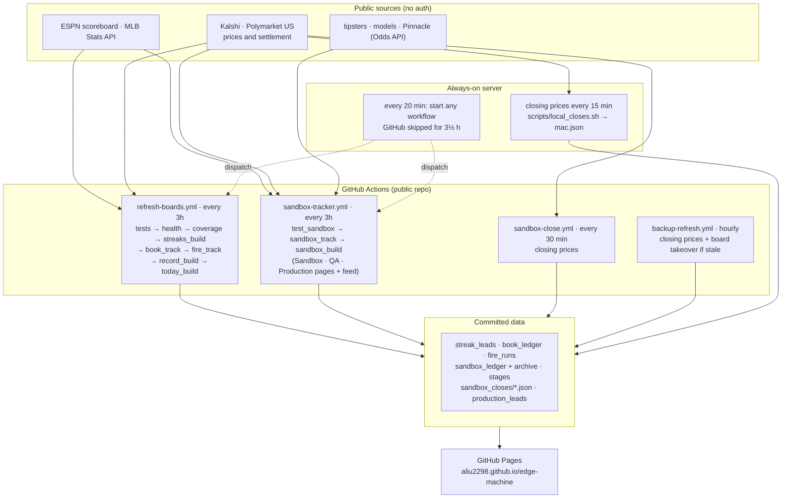

# Edge Machine

Paper-tracked prediction research: every idea is logged at the price that existed, settled on
the real result, and moved up a ladder only when the numbers hold. Nothing in this repo places
bets or holds exchange credentials.

**Board → https://aliu2298.github.io/edge-machine/**

| Page | What it is |
|---|---|
| [Leads](https://aliu2298.github.io/edge-machine/) | Upcoming fixtures (next 48h) on the two lanes: over 1.5, and a side to score 2+ |
| [Streaks](https://aliu2298.github.io/edge-machine/streaks.html) | Every tracked team's current runs, and the sides on the longest ones |
| [Record](https://aliu2298.github.io/edge-machine/record.html) | Every measured result on one ranked table — working / not working / too early — with the detail tables folded below |
| [Today](https://aliu2298.github.io/edge-machine/today.html) | Today's and tomorrow's fixtures as the leads' control group, with hit/miss and P/L on every lead and market |
| [Sandbox](https://aliu2298.github.io/edge-machine/sandbox.html) | Every forecaster and rule under test, one row per (source, sport), sorted into working / not working / too early |
| [QA](https://aliu2298.github.io/edge-machine/qa.html) | Only the pairs that succeeded in the Sandbox, re-tested before Production |
| [Production](https://aliu2298.github.io/edge-machine/production.html) | The pairs that earned their place, and their open leads — also published as `data/production_leads.json` |

## Current state (2026-09-17)

* **Sandbox:** 3 pairs working (ESPN FPI · MLB +22.8% on 52, Covers · MLB +17.3% on 51,
  SoccerPredictions · Soccer +13.8% on 71), 1 not working (Scores24 · MLB −25.1% on 35), the
  rest too early. Retired: SportsGambler, the National Weather Service, the table tennis
  0.55–0.60 band.
* **Production:** SoccerPredictions · Soccer (moved by hand, production at 70 bets) and the
  team-scores-1+ rule (fast track, probation).
* **Rules under test:** ten pre-registered rules, listed under
  [Markets and rules](#markets-and-rules). The tennis favourite band reached QA on its whole
  record and was demoted the next run for buying no better than the closing price.
* **Leads:** 224 graded (73% hit), 111 pending. Neither lane has beaten the teams' own rate
  or the price yet.
* **Pipeline:** GitHub builds and publishes everything; an always-on server runs the
  15-minute closing-price job and restarts any workflow GitHub's scheduler skipped.

## Architecture



**Why the server exists.** GitHub silently drops scheduled runs when it is busy: in the week of
2026-09-13 it ran about half of the 3-hour runs and about one in eight of the 30-minute ones.
Every run that starts succeeds, so the boards are only delayed — but closing prices must be taken
in the hour before a start, and those were being missed. The server runs the same
`scripts/local_closes.sh` every 15 minutes (it writes only `data/sandbox_closes/mac.json`), and
dispatches `sandbox-tracker.yml` / `refresh-boards.yml` through the GitHub API when either has not
run for 3½ hours. GitHub still does all the building and publishing, and its own schedules stay
on as a backup. Nothing is entered by hand.

## Components

| File | Role |
|---|---|
| `streaks_fetch.py` | ESPN fixtures and results for 12 lead leagues + 7 form feeds, a month at a time. |
| `streaks_build.py` | Leads (both lanes and the shadow rule) → `index.html` and `streaks.html`. |
| `streaks_track.py` | Logs each published lead, prices it, grades it; `rule_compare` for the over-1.5 change. |
| `venue_book.py` | Prices leads and fixtures on Kalshi and Polymarket US (ask + taker fee; midpoint as fair). |
| `book_track.py` | Prices every fixture inside 24h and grades it: the book's calibration ledger. |
| `model.py` | Shrunk-Poisson probability per priced market, scored against the book. |
| `fire_track.py` | Long runs, tested against a shuffled-schedule null. |
| `record_build.py` | The Record page: every result ranked into working / not working / too early. |
| `today_build.py` | The Today page (control group). |
| `sandbox_sources.py` | One adapter per forecaster, venue, market and rule (`SOURCES`, `CHALLENGERS`). |
| `sandbox_track.py` | Logs every forecast at the price, settles, judges (`assess`), moves pairs between stages. |
| `sandbox_build.py` | Sandbox and QA pages. |
| `sandbox_close.py` | Closing prices for bets about to start, one shard per writer. |
| `production.py` | Production pairs, `data/production_leads.json` and the Production page. |
| `health.py`, `verify_coverage.py` | Warn-only guardrails: freshness, stuck leads, feed and league coverage. |
| `test_streaks.py`, `test_book.py`, `test_today.py`, `test_sandbox.py` | Logic tests; the workflows refuse to publish when they fail. |
| `scripts/local_closes.sh` | The server's 15-minute closing-price job (from a dedicated clone). |
| `app.py`, `web/` | Optional local tracker UI (read-only). |

## Run locally

```bash
python3 streaks_build.py && python3 book_track.py && python3 fire_track.py \
  && python3 record_build.py && python3 today_build.py      # the boards, in workflow order
python3 sandbox_track.py && python3 sandbox_build.py         # the Sandbox, QA and Production
```

Generated pages under `public_site/` are rebuilt by the workflows; commit code, not pages, or a
running workflow can collide with you on the rebase (the tracker now keeps its own copy if it does).

## The Streaks board

Tracks 12 leagues: the big five (Premier League, La Liga, Bundesliga, Serie A, Ligue 1),
Eredivisie, Primeira Liga, Scottish Premiership, MLS, Saudi Pro League, and the
Champions/Europa Leagues.

Seven more — Belgian, Norwegian, Greek, Austrian, Danish, Cypriot and Turkish top flights —
are pulled as **competitive form feeds**. The European competitions drag in opponents from
leagues the board does not track, and those sides arrived with *no form at all*: 21 teams
in upcoming fixtures had zero games, so 48 of 273 upcoming fixtures could never produce a
lead — silently, because `find_leads` skips a fixture when either side lacks form and a
skipped fixture looks exactly like "no confluence today". With the feeds in place that gap
is now **13 of 208**, from **10** sides with no form at all (leagues ESPN does not serve:
Czech, Polish, Croatian, Ukrainian, Israeli, Bulgarian, Slovenian, Slovak, Azerbaijani,
Armenian). `verify_coverage.py` names them rather than letting the gap pass as silence.
They are real football, so they count as form and enter the baselines, but they carry
`lead_source: False`: the tracked league list is deliberate, and quietly turning seven more
leagues into lead sources would change the product rather than fix the gap.

**ESPN is read a month at a time (since 2026-09-15).** ESPN began answering almost every
`dates=START-END` scoreboard query with HTTP 400, which emptied the board (0 leads) for one refresh.
`streaks_fetch.fetch_range` now asks for one month (`dates=YYYYMM`) at a time and re-reads a month
day by day if it hits ESPN's 100-event cap, so a busy month is never silently truncated.

**Leads run in two lanes, one market each.**

| Lane | Rule (since) | Published? |
|---|---|---|
| **Over 1.5** | Both sides' competitive games went over 1.5 in **9+ of their last 10**, 10+ games each (`over15_form_leads`, since 2026-09-14) | Yes |
| **A side to score 2+** | A side scoring 2+ in every recent game against an opponent that concedes (2+ or at all) in every recent game (`LEAD_PAIRINGS`, since 2026-09-12) | Yes |
| Over 1.5, run pairings | Both sides over 1.5, or both scoring, in every recent game — the lane's rule until 2026-09-14 (`SHADOW_PAIRINGS`) | No: logged, priced and graded in `data/streak_leads_shadow_over15.json` so the Record compares the two rules on the same weeks |

The over-1.5 rule changed because research on 530 matches (cutoffs fixed before it ran) found the
9-of-10 rule hit 92.9% against the teams' own earlier 81.4%, where the run pairings had never beaten
the teams' own rate. Its first real-price week earned about what the run lane did (+2.0% v +2.2%), so
the change is measured rather than assumed: `rule_compare` sets both side by side from `RULE_CHANGE`.
Each lane is judged on its own claim and never pooled with the other.

Over 1.5 lands in ~85% of matches with no flag at all, so a hit proves nothing on its own: the
price is the test.

A **lead** is not a streak on its own — plenty of good sides score freely. Both legs must
run at least 3 games, and **the pair must imply the bet arithmetically**:

| evidence | shape |
|---|---|
| both sides score — 1 + 1 ≥ 2 | a true *confluence*: two different events about this fixture, adding up to clear the line |
| both sides' matches go over 1.5 | evidence *stacking*: each leg alone already implies the bet, since this fixture is one of each side's matches |

Only the first matches the "one side's run meets the other's" framing. Both are legitimate
evidence; they are not the same logical shape, and the board says which is which.

That rules out the pairing that looks most natural. "A have scored in N straight" plus "B
have conceded in M straight" reads like two pieces of evidence, but in a match between them
**A scoring and B conceding are the same event**, counted twice — and it only implies one
goal, so it says nothing about a 1.5 line.

**Prices come from the exchanges (since 2026-09-13).** Bovada was the book until it began
answering every request with a cookie redirect loop. `venue_book.py` now prices each lead and
every fixture inside 24h on **Kalshi and Polymarket US**, the two regulated US exchanges:
over 1.5 / 2.5 from Polymarket US's totals ladder or Kalshi `KX{LEAGUE}TOTAL`, BTTS from Kalshi
`KX{LEAGUE}BTTS`, a side to score 2+ from Kalshi `KX{LEAGUE}TEAMTOTAL`. Where both list a market
the cheaper effective price wins. `price` is decimal odds at the ask **plus taker fee** (what a
follower pays); `fair` is the book's midpoint. A one-sided book, or a spread over 10¢, is no
price. No URL is stored in a ledger — `market_url()` builds the card's Kalshi / Polymarket
button at render time. The matcher (both sides must match, same day, near-ties refused) is
kept from an earlier matcher, thresholds unchanged. Coverage is narrower than a sportsbook: when
measured, 60% of over-1.5 leads and 31% of team-2+ leads had a venue market — the
rest cannot be traded and are graded on hit rate only. Leads priced before the switch keep
their Bovada price (a price is never revised), and the Record shows how the priced sample
splits between the two.

Two design choices worth knowing:

* **Form is cross-competition, and includes preseason.** A team's last 6 games span every
  tracked competition, not just the one their next fixture belongs to — form does not reset
  when a side walks into a European tie, and early season it is the only thing that works
  at all (UCL/UEL sides have played ~2 European games). Preseason **friendlies** are pulled
  too, so a promoted club or a second-tier side in a cup tie has a form line instead of a
  blank. Friendlies are marked with dashed pills and a note, are **excluded from the
  baselines** (they are higher-scoring and less serious, and would shift the yardstick),
  never generate a lead of their own, and a run made up *entirely* of friendlies is
  discarded rather than shown as evidence.
* **Every run is shown with its base rate.** This repo has already falsified three signals
  that looked good until measured. The trap each time was reading a pattern without asking
  how often it shows up by chance, so each run is rendered next to the share of tracked
  teams currently on a run that long. A 5-game scoring streak that a fifth of the league is
  also on is not a lead, and the board says so.

Confluences are genuinely rare — whole leagues can have none on a given day. The **All teams
on a run** tab exists for that: it browses every tracked team's current runs directly,
rather than showing an empty league.

### Prices (added 2026-09-12)

Lift says whether a confluence carries information; it cannot say whether it pays, because
the sportsbook already prices what the teams do. Measured the day this was added: over 1.5
on lead fixtures traded at **~1.20 on Bovada — a break-even hit rate of 83.3%**, which is
essentially what leads hit (82.5% live, 79.7% in the walk-forward). So every lead is now
priced as well as graded:

* the line is captured the **first build it is listed** (Bovada's per-event page, one paced
  request per fixture — the bulk feed only carries the main 2.5 total), never revised, and
  **never taken after kickoff**;
* **three fixture-level markets** are logged on every lead — over 1.5 (the claim), over 2.5
  and BTTS — fixed in advance so no market is chosen after seeing which one paid;
* P/L is a flat 1 unit; the Record page shows each market's hit rate against the
  **break-even** rate the average price demands and the book's own **vig-free probability**.

A lead graded before pricing existed simply does not appear in that section.

### Model v book (added 2026-09-12)

Lift against the teams' own rate cannot be improved by tuning streak rules: a run is the
noisiest estimate of a rate there is, so selecting on one guarantees regression (the top
20% of team-games by raw 2+ rate predicted 65% and delivered 56%). The number that pays is
against the **book**, whose vig-free probability is a better estimate than any form scrape.
So `model.py` — independent Poissons on each side's attack and defence ratings, pooled
across competitions and shrunk hard toward average (`SHRINK=24`, chosen on a walk-forward
where 8 was visibly overconfident) — logs its probability for every priced market at the
moment the price is captured, never revised. The Record page scores model and book by
**Brier** on the same settled leads, and reports a **pre-registered value split**: leads
where the model beats the book's fair probability by 5pp or more, against the rest. (Since
2026-09-13 an exchange-priced quote is judged against the effective price paid — ask plus
fee — not its midpoint; Bovada-priced quotes keep the original vig-free rule. See
`streaks_track.value_edge`, shared by Today, Record and the book ledger.) If the
model carries anything the book does not, that group out-hits and out-earns the rest; if
not, the book is the better estimate and no selection rule built on form can beat it.

On the walk-forward the model beats a flat league rate only marginally (Brier −0.002 to
−0.007); the book will be a much harder yardstick. That is the honest prior.

### The book, on every fixture (added 2026-09-12)

A per-team "profitable" tag built from leads would confound the team with the streak all
over again — leads only observe a side while it is on a run, exactly when its next result
regresses — and grow at one lead a week. So `book_track.py` keeps a separate ledger: **every
competitive fixture is priced once it is inside 24h of kickoff**, whatever the form on
either side, on five markets (over 1.5, over 2.5, BTTS, each side to score 2+), with the
model's probability logged beside each price, and graded on the final score. That makes it a
calibration ledger for the book itself: hits against the hits the book's own vig-free
probabilities predicted, as **excess** and **z**, by market, by league, by home/away, by
price band, and — as a drill-down — by team. A team is tagged **PAYING** on the All-teams
tab only past 20 observations with z ≥ 2, and the page says how many teams were tested,
because with ~230 of them about six reach z = 2 by chance. Read the league and price-band
tables first; they pool dozens of teams and are readable weeks before any team row.

### Tracking and grading

Every lead is logged to `data/streak_leads.json` when it is published and graded once its
fixture is played — automatically, in the same daily job. Each pairing carries a
machine-checkable claim (`{"kind": "team_gte", "n": 2, ...}`) so grading never depends on
someone deciding after the fact what a card "meant". A lead that cannot be judged is voided,
never scored as a miss.

**What this measures is information, not profit.** The board carries no odds, so ROI is
unmeasurable — and a hit rate alone says nothing ("over 2.5 landed 60%" is meaningless
without a reference). Each lead is therefore compared against the **league-adjusted base
rate** for that same outcome. The adjustment is not cosmetic: BTTS leads cluster in
high-scoring leagues, and on the backtest a global baseline showed a +17.1pp BTTS lift that
fell to +10.7pp — and lost significance — once each lead was compared against its own
league. **Lift is the number that counts.**

`streaks_backtest.py` replays the same rules over already-played fixtures, computing each
side's form only from games *before* the fixture in question (no lookahead). It exists so
the idea is falsifiable today rather than in a month, and so the grader itself is verified.

**Current state (Sep 12 2026): the two live lanes are answered, and the answer is no.**
113 graded leads hit 75.2% overall; 738 on the walk-forward hit 79.7%. Against the teams'
own rates *and* against the price the book actually offers, both live markets are negative:

| lane | n | hit | teams' own rate | break-even at the price | edge |
|---|---|---|---|---|---|
| over 1.5 | 40 | 82.5% | 84.0% | 83.3% (≈1.20) | **−0.8pp** |
| over 2.5 | 24 | 54.2% | 65.0% | 60.4% (≈1.67) | **−5.8pp** |

Two independent references agree, which is the point of having both. The over-1.5 case is
worth understanding because it is not a tuning problem: at 1.20 you need 83.3%, and those
teams' own rate is 84.0% — the book has priced the market at essentially the teams' true
rate, leaving under a point of room, and the leads land below it. **No threshold change
recovers that**; the signal knows what the market already knows.

No edge is claimed. What the fixed cadence buys is a clean, uncorrelated, continuously
accumulating sample, and the `book_track` ledger below now measures the same question at
roughly seven times the rate.

### On-fire runs: measured against a shuffled schedule, not a base rate

Long runs get no baseline column, because three were tried and all three were wrong — the
population rate (+12.8pp, "significant": teams on scoring runs are simply good teams), the
team's own rate (−8.7pp, "significant": circular, since the run's own games are inside the
team's average), and the team's rate with the run removed (+10.3pp: over-corrects, since
deleting a run deletes only successes). Same games, three answers, two of them significant
in opposite directions.

The reference is not an average at all. **Shuffle a team's own games into a random order**
and runs carry zero information by construction — yet being "on a run" still predicts a
next-game rate 17–39pp *lower*, because a run ends the moment it fails and the games after
one are pre-selected against. That shuffled band is what "no signal" looks like, and a
result only counts if it lands outside it.

Two implementation choices turned out to matter more than the data:

* **The first `FIRE_MIN` games of every team are discarded.** No run is reachable there, so
  counting them forces that stretch entirely into the control arm — and a team's opening 8
  games hit **4.3pp lower** than its later ones. In the real order that depresses the
  control; a shuffle scatters it. Including them alone flagged three streak types
  SIGNIFICANT.
* **The test is never restricted to the teams in the ledger.** A team reaches the ledger
  only by going on a real run, so it always supplies an on-run arm in the real order and
  often none in a shuffle — culling ~25% of teams from the null and none from the
  observation. That mismatch alone produced p = 0.005–0.015.

**Current state (Sep 12 2026, n=265 graded, 80.0% extension): nothing survives
correction.** The closest is **over 1.5**, whose on-minus-off gap of −17.5pp sits just
outside a [−37.6, −20.8] shuffled band: p = 0.012, but **p adj = 0.084** across the seven
streak types tested together. It is stable across seeds (p = 0.008–0.012 at 2000
shuffles) and it is the nearest thing this repo has produced to a signal, so it is worth
watching — but it is not significant, and one marginal cell out of seven is the expected
outcome even when nothing is there.

⚠️ At **400** shuffles the same data flagged SIGNIFICANT (p adj 0.035). That was
permutation noise, which is why `PERMUTATIONS` is 2000 and why `iters`/`seed` are resolved
at call time — bound as signature defaults they silently ignored an override, and a
seed-stability audit ran the same seed four times and looked reassuring.

The tab remains a browse surface for what is happening, not a signal.

Leads are research to look at. Nothing here places or stages a bet.

## The Sandbox ladder

Sandbox asks **"does anyone's signal pay?"** It logs what published forecasters and pre-registered
rules say, stamps each call with the price that existed at that moment, and settles it on the real
result. Each **(source, sport) pair** is judged on its own and climbs a ladder:

**Sandbox → QA → Production**

### How a call is logged

* **Tipsters and rules name a side** and are backed every time at the going price. **Models, books
  and exchanges state a probability** and are backed only on a 3pp disagreement with the price, and
  also get a Brier score. Everything is a flat $100.
* **Venues.** Polymarket US prices and settles everything it lists; Kalshi is the venue for soccer
  (and its goals, BTTS and team-total markets) and fills the gaps. polymarket.com is a comparison
  source only; its bets never count toward QA (`TRADEABLE_VENUES`).
* **A price needs a real book** (spread ≤ 10¢) and is booked at the ask. **Nothing is logged once a
  contest has started**; anything logged at or after its start is voided.
* **Kickoffs:** soccer takes ESPN's kickoff (Kalshi publishes none); fight nights are re-timed from
  Pinnacle's per-bout times.
* **Closing prices** are taken in the hour before each start by four writers (the tracker, the
  30-minute job, the watchdog, the server) into `data/sandbox_closes/<writer>.json`, merged on the
  next tracker run. Only a snapshot within 60 minutes of the deadline counts toward CLV.
* **Ledger size:** bets stay in the ledger 45 days, price-only rows 7; everything leaving is copied
  to `data/sandbox_archive/YYYY-MM.json` (price-only rows in compact form), so no judgement changes.

### How a pair is judged

Every judgement compares the pair with a reference, never a bare hit rate:

* **Won v priced (z):** wins against the wins the prices implied.
* **v blind:** ROI against backing the favourite / underdog / draw on the same contests — or, for a
  rule that always backs one side, against its **population** (`baseline="population"`: that side on
  every listed match; `"favourite_population"`: the favourite on every match).
* **Beat the close:** closing price minus price paid.
* **Readable** only at 30+ settled bets; below that a pair is sorted by which way it leans.

### The gates (per sport)

| Gate | Standard sports | Tennis, table tennis (`HIGH_VOLUME_SPORTS`) |
|---|---|---|
| **Sandbox → QA** | 30+ settled bets over 14+ days, z ≥ 1, beats every blind rule, profitable without its biggest win | **50+** settled bets, **no day span**, **z ≥ 1.5**, same other checks |
| **Judged in QA on** | bets logged after promotion only | its **whole record** (Sandbox bets count) |
| **QA → Production (ready)** | the stamp on that record (50+ bets over 28+ days, z ≥ 2, beats every blind rule, no one hit, both halves) **plus** beats the close (30+ closes covering half the bets), profitable after fees, every bet publishable, held 7 days | **50+** bets, no day span, **z ≥ 2.5**, same other checks |
| **Demoted when** | after 30 bets: behind the price, not beating every blind rule, or behind the close; or 21 days without a bet | after **50** bets, same reasons |

Two ways around the ladder, both recorded in `data/stages.json`:

* **Fast track** (`SOURCES[...]["fast_track"]`): in Production on probation from the first bet; at 30
  bets it stays only while profitable after fees with z ≥ 1, otherwise back to the ladder for good.
  Today: `team1_form_l5`.
* **Moved by hand** (`PAIR_OVERRIDES`): moved to QA immediately, judged on its whole record, ready
  the run that record reaches `production_at` bets while profitable after fees. Today:
  SoccerPredictions · Soccer (production at 70).

A retired source (`connected=False` with a `retired` reason) logs nothing new; its open bets still
settle and its record stays under the Sandbox page's Reference section.

### Production

`production.py` publishes every bet a Production pair logs after entering Production, in the Leads
ledger's shape (`leads`, `updated_at`, `board_built_at`, `last_seen_at` on open leads), to
`data/production_leads.json`. Only bets the feed can express are published (`placeable`): a soccer
result — home, away or **draw** — on a Kalshi game market, or Yes on a Kalshi soccer goals market,
in a mapped league; and only with an ESPN-verified kickoff. Bet shapes: `match_result`
(`side` home / away / draw), `total_gte`, `team_gte` (with `team`).

### Markets and rules

Rules are pre-registered from research fixed before it ran; research that failed is recorded too.

| Rule | Market | Backs | Research | Status |
|---|---|---|---|---|
| `team1_form_l5` | Kalshi team total over 0.5 | a side that scored in 5/5 v an opponent that conceded in 5/5 | 91.9% on 99 v 77.9% own; 10/10 at real prices | Production (fast track) |
| `p05_unbeaten` | Kalshi win market, **No** (the other side +0.5) | a side unbeaten in 8+/10 v an opponent that won ≤3/10 (same competition) | 82.5% on 97 v 70.6% own, 0/1,000 shuffles; +11.2% on 64 priced | Sandbox |
| `u35_low_scoring` | Kalshi Over 3.5, **No** | both sides scored ≤1 in 7+/10 (same competition) | 80.5% on 41 v 61.7% own; +20.2% on 27 priced | Sandbox |
| `o15_form_l10` | Kalshi over 1.5 | both sides' games over 1.5 in 9+/10 | 92.9% on 84 v 81.4% own; +2.0% on 20 priced | Sandbox (also the Leads rule) |
| `team2_form_l10` | Kalshi team total over 1.5 | a side scoring 2+ in 7+/10 v an opponent conceding 2+ in 7+/10 | 76.2% on 21 v 45.3% own | Sandbox |
| `btts_form_l10` | Kalshi BTTS | both sides' games BTTS in 7+/10 | +10pp v own on 77, not significant | Sandbox |
| `tennis_fav_band` | Polymarket US / Kalshi | the player priced 0.75–0.90 | 86.4% v 81.1% priced on 88, z +1.26 | Sandbox (demoted from QA: no better than the close) |
| `mma_fav_band` | Kalshi | the fighter priced 0.75–0.90 (tennis rule, unchanged) | none (out-of-sample test) | Sandbox |
| `mlb_fade_streak` | Kalshi MLB game | a team 3-or-fewer of its last 10 v one 7-or-more (next game only) | +3.0% on 239 (2025), +4.6% on 149 (2026) | Sandbox |
| `cmd_tail` | Kalshi daily commodity strike (WTI, Brent, gold, silver, copper, natural gas, AAA gasoline) | the near-certain side, priced 0.97–0.995 | 99.3% v 98.3% priced on 778 bets over 224 day-clusters, +1.0% after fees; bootstrap +0.3% to +1.5% | Sandbox — **selling the tail**, measured not traded |
| `nhl_rest_edge` | Kalshi NHL game | the **home** side rested a day or more v a visitor on the second night of a back-to-back | 64.9% v 58.3% priced on 74, +7.5%, steady across the season | Sandbox (registered before the 2026-27 season) |
| `nhl_dog_pl` | Kalshi NHL spread, **No** | the underdog +1.5, every listed game | +15.7% while the market was new, then −3.7% and −6.8% as it converged | Sandbox — an **observation**, testing whether October softness returns |
| `tt_band_55_60` | Polymarket US | the player priced 0.55–0.60 | one spiky band in 129 matches | **Retired** — on new matches it won exactly at the price |

Each market has a never-betting **Baseline** source (`btts_market`, `goals_market`) that logs the
price on every listed match, which is the population its rules are judged against.

**Researched and not added:** tennis surface Elo (scored worse than the market); soccer over 2.5
and under 4.5; unders built on past game totals or defences; the +1.5 spread rules (priced ~88%, +2–6%);
the MLB last-5 / last-20 windows and every MLB run-total rule; WNBA totals (the market moves its
line for high-scoring teams); WNBA and NBA fade-the-streak (−64% and −37%), favourite band and spread
rules; NBA first-half, first-quarter and both-teams-100 overs (thin books, ~19¢ spreads, both sides
overpriced); the daily commodity ladders in their ordinary bands — backing whichever side the
market favours won 87.7% against an 87.5% price, and the 0.90–0.97 band returned −1.3%, so the
favourite–longshot bias there is real in mid-price but the spread swallows it; the NHL moneyline in every slice tried (favourites −5.2%, underdogs −3.3%, home −4.6%,
the 0.60–0.75 band −10.1%), NHL form rules from 10-game win rates (+0.4%), and "tired teams mean
overs" (back-to-back games go slightly *under*).

### Sources

Tipsters: Covers, OLBG (boxing, MMA), Oddspedia (cricket), Scores24, SoccerPredictions.ai.
Models and books: ESPN FPI, DraftKings, Pinnacle (The Odds API, `ODDS_API_KEY` secret, credits paced
to last the month and spent where nothing else covers). Exchanges as comparison sources: Kalshi,
polymarket.com. Retired: SportsGambler (−7% on 43), the National Weather Service (−19% on 31).

## Data handling

`predictions.db` is **git-ignored** and stays local, so the raw database is never
committed. `data/predictions.json` is a frozen archive of the 118 manually-entered sports picks
that predate the leads ledger; nothing writes to it any more, and stake was stripped
from it because the repo is public.

Secrets (`.apifootball_key`, `*.pem`) are git-ignored. A fresh checkout creates empty
tables on first run.

**This repo places no bets and holds no exchange credentials.** The server holds only a GitHub
token limited to starting this repo's workflows, and a deploy key with write access to this repo
that is used only to push the closing-price file. An earlier lane traded
event contracts through an authenticated, request-signing client; that client, its staged
-order endpoints, its React approval panel and the unused venue matcher were all removed
in Sep 2026. There is no order-placing code path left — every surface is read-only.

## Notes

Quarter-line Asian handicaps (`+0.25` / `+0.75`) settle as half win / half loss. Anything
that cannot be graded with confidence is marked `ungraded` with a null P/L rather than being
silently scored a loss.

## Retired lanes

Removed after measurement, not abandoned on a hunch — each was tracked to a real sample and
falsified:

* **Tips** (sportsgambler.com's published predictions, removed Aug 2026) — all three tracked
  signals measured at n≈160. The tip itself: −0.3% ROI, bootstrap CI [−0.139, +0.131], dead
  flat. BTTS implied side: 62.1% hit vs 63.2% market-implied — well-calibrated, the loss is
  just the vig. Projected exact score: −37.2% ROI, CI [−0.676, −0.017], a *significant*
  loser. No edge to keep.
* **Earnings** (company quarterlies + earnings-call mention markets on an event-contract
  exchange, removed Aug 2026; the exchange integration itself was removed Sep 2026).

Picks are research, not betting advice.
