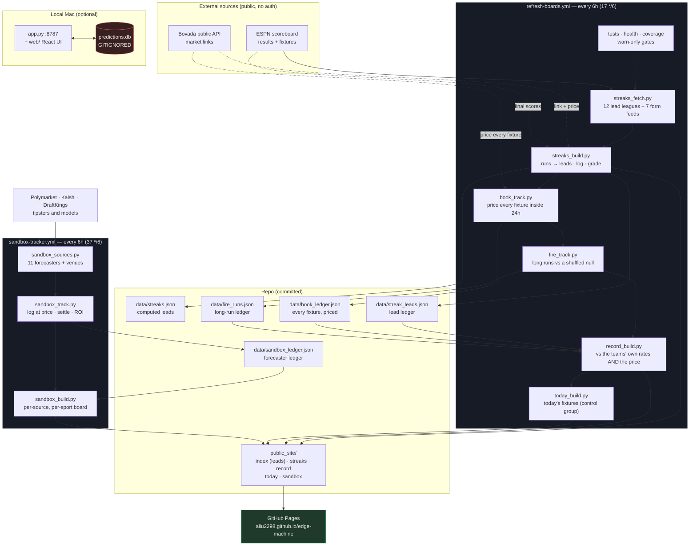

# Edge Machine

Paper-tracked betting research: a local tracker plus a self-updating board.
Nothing here places bets — every surface is read-only, and results are recorded to test
whether an idea actually holds up.

**Board → https://aliu2298.github.io/edge-machine/**

| Board | What it is |
|---|---|
| [Leads](https://aliu2298.github.io/edge-machine/) | Upcoming fixtures where both sides' runs point at the same total |
| [Streaks](https://aliu2298.github.io/edge-machine/streaks.html) | Every tracked team's current runs, and the sides on the longest ones |
| [Record](https://aliu2298.github.io/edge-machine/record.html) | Every graded result — leads and on-fire runs — against what those teams do anyway |
| [Today](https://aliu2298.github.io/edge-machine/today.html) | Every tracked fixture kicking off today, with both sides' current runs |
| [Sandbox](https://aliu2298.github.io/edge-machine/sandbox.html) | Which forecasters actually make money, tracked per sport at real prices |

## Architecture



The pipeline runs entirely on GitHub's servers, so the board stays current whether or not
the Mac is on. Nothing is entered by hand: every published lead is logged at publish time
and graded against ESPN final scores once its fixture is played.

## Components

| File | Role |
|---|---|
| `app.py` | Local tracker: stdlib HTTP server + SQLite. Picks, base rates, auto-settlement. Read-only; it places nothing. |
| `web/` | React + Vite + Tailwind UI for the tracker (`npm --prefix web run build`). |
| `venues.py` | Shared fixture→market matcher (Bovada). |
| `record_build.py` | Renders the consolidated record to `public_site/record.html`. |
| `today_build.py` | Renders today's fixtures to `public_site/today.html`. |
| `streaks_fetch.py` | Pulls recent + upcoming fixtures for 12 leagues from ESPN. |
| `streaks_build.py` | Finds streak confluences; renders `index.html` (Leads) and `streaks.html`. |
| `streaks_track.py` | Logs each published lead and grades it once the fixture is played. |
| `streaks_backtest.py` | Walk-forward replay of the same rules over past fixtures. |
| `model.py` | Shrunk-Poisson probability per priced market, scored against the book on Record. |
| `book_track.py` | Prices every fixture inside 24h and grades it: the book's calibration ledger, `data/book_ledger.json`. |
| `test_book.py` | Logic tests for the book ledger. |
| `test_streaks.py` | Logic tests for run detection, lead pairing, grading and the ledger. |
| `health.py` | Warn-only guardrails: lead freshness, stuck or vanished leads, dead venue feed. |
| `verify_coverage.py` | Proves every league's squad reaches the board. |
| `fire_track.py` | Logs long runs; tests them against a shuffled-schedule null. |
| `sandbox_sources.py` | One adapter per forecaster and venue: what each publishes, and how to read it. |
| `sandbox_track.py` | Logs every forecast at the price that existed, settles it, scores ROI and Brier. |
| `sandbox_build.py` | Renders the Sandbox board to `public_site/sandbox.html`. |
| `sandbox_browser.py` | Headless fetch for the sources that need a real browser. |
| `test_sandbox.py` | Logic tests for the Sandbox adapters, staking rules and scoring. |
| `.github/workflows/refresh-boards.yml` | Six-hourly (`17 */6`): tests → health → coverage → streaks_build → book_track → fire_track → record_build → today_build → publish to Pages. |
| `.github/workflows/backup-refresh.yml` | Watchdog on `17 3,9,15,21`, out of phase with the primary; takes over only if that run failed or the live board is stale. |
| `.github/workflows/sandbox-tracker.yml` | Six-hourly (`37 */6`), 20 minutes after the primary: collect forecasts, settle, rebuild the Sandbox board. |

## Run locally

```bash
python3 app.py            # tracker UI + API on :8787
npm --prefix web run dev  # frontend dev server on :5173
```

Rebuild the public boards by hand, in the order the workflow uses (later steps read what
earlier ones write):

```bash
python3 streaks_build.py && python3 book_track.py && python3 fire_track.py \
  && python3 record_build.py && python3 today_build.py
```

The Sandbox board is a separate pipeline on its own schedule:

```bash
python3 sandbox_track.py && python3 sandbox_build.py
```

## The Picks board (retired 2026-09-12)

For two weeks the site root was a 3-card slate: three leads re-drawn automatically
(rarest first, one per fixture, one per team), locked at draw and graded on the final
score. It was retired because it only ever re-drew three of the leads the Leads board
already publishes and the Record page already grades — its 28 settled picks were a strict
subset of the leads ledger, so the section was a second, smaller read of the same
evidence. The Leads page now sits at the root; `leads.html` redirects there. The code is
in git history (`slate.py`, `slate_build.py`, `slate_backtest.py`, `test_slate.py`).

One lesson from it survives in `health.py`: a fixture that is **abandoned or postponed
vanishes from the ESPN feed** and can never grade. FC Utrecht v Go Ahead Eagles
(2026-09-05) sat pending for a week that way, so the guardrail now flags a lead that is a
day overdue *and* absent from the feed rather than waiting out the ledger's 7-day void.

## The Streaks board

Tracks 12 leagues: the big five (Premier League, La Liga, Bundesliga, Serie A, Ligue 1),
Eredivisie, Primeira Liga, Scottish Premiership, MLS, Saudi Pro League, and the
Champions/Europa Leagues.

Seven more — Belgian, Norwegian, Greek, Austrian, Danish, Cypriot and Turkish top flights —
are pulled as **competitive form feeds**. The European competitions drag in opponents from
leagues the board does not track, and those sides arrived with *no form at all*: 21 teams
in upcoming fixtures had zero games, so 48 of 273 upcoming fixtures could never produce a
lead — silently, because `find_leads` skips a fixture when either side lacks form and a
skipped fixture looks exactly like "no confluence today". With the feeds in place that gap
is now **13 of 208**, from **10** sides with no form at all (leagues ESPN does not serve:
Czech, Polish, Croatian, Ukrainian, Israeli, Bulgarian, Slovenian, Slovak, Azerbaijani,
Armenian). `verify_coverage.py` names them rather than letting the gap pass as silence.
They are real football, so they count as form and enter the baselines, but they carry
`lead_source: False`: the tracked league list is deliberate, and quietly turning seven more
leagues into lead sources would change the product rather than fix the gap.

Fourteen sides still have no form, from leagues ESPN does not serve (Czech, Polish,
Croatian, Ukrainian, Israeli, Bulgarian, Slovenian, Slovak, Azerbaijani, Armenian). That is
a data limit, and `verify_coverage.py` now names them rather than letting the gap pass as
silence.

**Leads run in two lanes, one market each: over 1.5, and (since 2026-09-12) a side to
score 2+.** Eight bet types meant every market carried a thin, separately underpowered
sample; narrowing to one pooled it completely. The team-2+ lane was added back on top as a
*priced* second lane — the board's original question ("Barcelona have scored 2-3 in six
straight and the next opponent concedes 2"), and the one market here that trades near evens
rather than at 1.20, so an edge, if one exists, would actually pay. Two pairings feed it:
the team scoring 2+ in every recent game against an opponent that has conceded 2+ in every
recent game (sharper, rare — 11 fixtures in 763 on the walk-forward) or merely conceded in
every recent game. Each lane is judged on its own claim and never pooled with the other.
Go in expecting what the walk-forward says: neither pairing beats the side's own 2+ rate
(−3 to −5pp, not significant); the test is whether the *book* misprices them.

Over 1.5 rather than over 2.5 for two reasons, one measured and one structural:

* on the ledger to date it is the only market with a **positive lift** — +4.7pp at n=19,
  **not significant** — while over 2.5 ran −12.5pp at n=14. That is thin evidence, and
  picking the leader of five markets after seeing the table is a multiple-comparisons
  trap. This was a decision taken *on top of* the numbers, not one they established.
* a lopsided line is **cheaper to test**. Binomial variance is p(1−p), so at an 85% base
  rate each graded lead carries ~1.9× the information about a fixed percentage-point lift
  than one at over 2.5's 62%. Detecting +5pp needs ~760 graded leads here versus ~1470.

The cost is that **over 1.5 lands in ~85% of matches with no flag at all**, so the board
now publishes claims that are usually right for reasons having nothing to do with streaks.
Lift against the teams' own rate is the only reading that means anything — see Record.

A **lead** is not a streak on its own — plenty of good sides score freely. Both legs must
run at least 3 games, and **the pair must imply the bet arithmetically**:

| evidence | shape |
|---|---|
| both sides score — 1 + 1 ≥ 2 | a true *confluence*: two different events about this fixture, adding up to clear the line |
| both sides' matches go over 1.5 | evidence *stacking*: each leg alone already implies the bet, since this fixture is one of each side's matches |

Only the first matches the "one side's run meets the other's" framing. Both are legitimate
evidence; they are not the same logical shape, and the board says which is which.

That rules out the pairing that looks most natural. "A have scored in N straight" plus "B
have conceded in M straight" reads like two pieces of evidence, but in a match between them
**A scoring and B conceding are the same event**, counted twice — and it only implies one
goal, so it says nothing about a 1.5 line.

Each lead links to its **Bovada market** where a line exists, via the shared matcher in
`venues.py`. Coverage inside three days is **51/53** of fixtures Bovada has posted; the
remainder are simply not listed yet. Beyond that it thins out — a sportsbook prices the
next few days and posts distant fixtures closer to kickoff, so a lead two weeks out has no
line yet and gains one as it approaches. A live card whose market has been pulled at
kickoff says **in play** rather than showing an empty corner.

The matcher compares the two sides **in order** and scores each on its most distinctive
token, because venues disagree about descriptors and not identity — ESPN's "Stade Rennais"
is Bovada's "Rennes", "Internazionale" is "Inter Milan", "Al Taawoun" is "Al Taawon". Three
things it has to get right, each of which was a real bug:

* **The side with fewer distinctive tokens must have all of them matched.** Scoring on the
  single best token alone rated "Real Madrid" vs "Real Sociedad" a perfect 1.0.
* **Names built entirely of short words must still match.** The old matcher required a
  token of 4+ characters, so "Rio Ave" could never link even though Bovada listed the
  fixture under exactly that name.
* **A duplicate listing is not an ambiguity.** Bovada publishes the same fixture more than
  once; counting a duplicate as a rival candidate made the ambiguity guard veto every
  ordinary match and dropped coverage from 46 to 36.

When two genuinely different fixtures both fit, it returns no link rather than guessing —
a wrong link is worse than none, since the card still reads as though it were checked.

Two design choices worth knowing:

* **Form is cross-competition, and includes preseason.** A team's last 6 games span every
  tracked competition, not just the one their next fixture belongs to — form does not reset
  when a side walks into a European tie, and early season it is the only thing that works
  at all (UCL/UEL sides have played ~2 European games). Preseason **friendlies** are pulled
  too, so a promoted club or a second-tier side in a cup tie has a form line instead of a
  blank. Friendlies are marked with dashed pills and a note, are **excluded from the
  baselines** (they are higher-scoring and less serious, and would shift the yardstick),
  never generate a lead of their own, and a run made up *entirely* of friendlies is
  discarded rather than shown as evidence.
* **Every run is shown with its base rate.** This repo has already falsified three signals
  that looked good until measured. The trap each time was reading a pattern without asking
  how often it shows up by chance, so each run is rendered next to the share of tracked
  teams currently on a run that long. A 5-game scoring streak that a fifth of the league is
  also on is not a lead, and the board says so.

Confluences are genuinely rare — whole leagues can have none on a given day. The **All teams
on a run** tab exists for that: it browses every tracked team's current runs directly,
rather than showing an empty league.

### Prices (added 2026-09-12)

Lift says whether a confluence carries information; it cannot say whether it pays, because
the sportsbook already prices what the teams do. Measured the day this was added: over 1.5
on lead fixtures traded at **~1.20 on Bovada — a break-even hit rate of 83.3%**, which is
essentially what leads hit (82.5% live, 79.7% in the walk-forward). So every lead is now
priced as well as graded:

* the line is captured the **first build it is listed** (Bovada's per-event page, one paced
  request per fixture — the bulk feed only carries the main 2.5 total), never revised, and
  **never taken after kickoff**;
* **three fixture-level markets** are logged on every lead — over 1.5 (the claim), over 2.5
  and BTTS — fixed in advance so no market is chosen after seeing which one paid;
* P/L is a flat 1 unit; the Record page shows each market's hit rate against the
  **break-even** rate the average price demands and the book's own **vig-free probability**.

A lead graded before pricing existed simply does not appear in that section.

### Model v book (added 2026-09-12)

Lift against the teams' own rate cannot be improved by tuning streak rules: a run is the
noisiest estimate of a rate there is, so selecting on one guarantees regression (the top
20% of team-games by raw 2+ rate predicted 65% and delivered 56%). The number that pays is
against the **book**, whose vig-free probability is a better estimate than any form scrape.
So `model.py` — independent Poissons on each side's attack and defence ratings, pooled
across competitions and shrunk hard toward average (`SHRINK=24`, chosen on a walk-forward
where 8 was visibly overconfident) — logs its probability for every priced market at the
moment the price is captured, never revised. The Record page scores model and book by
**Brier** on the same settled leads, and reports a **pre-registered value split**: leads
where the model beats the book's fair probability by 5pp or more, against the rest. If the
model carries anything the book does not, that group out-hits and out-earns the rest; if
not, the book is the better estimate and no selection rule built on form can beat it.

On the walk-forward the model beats a flat league rate only marginally (Brier −0.002 to
−0.007); the book will be a much harder yardstick. That is the honest prior.

### The book, on every fixture (added 2026-09-12)

A per-team "profitable" tag built from leads would confound the team with the streak all
over again — leads only observe a side while it is on a run, exactly when its next result
regresses — and grow at one lead a week. So `book_track.py` keeps a separate ledger: **every
competitive fixture is priced once it is inside 24h of kickoff**, whatever the form on
either side, on five markets (over 1.5, over 2.5, BTTS, each side to score 2+), with the
model's probability logged beside each price, and graded on the final score. That makes it a
calibration ledger for the book itself: hits against the hits the book's own vig-free
probabilities predicted, as **excess** and **z**, by market, by league, by home/away, by
price band, and — as a drill-down — by team. A team is tagged **PAYING** on the All-teams
tab only past 20 observations with z ≥ 2, and the page says how many teams were tested,
because with ~230 of them about six reach z = 2 by chance. Read the league and price-band
tables first; they pool dozens of teams and are readable weeks before any team row.

### Tracking and grading

Every lead is logged to `data/streak_leads.json` when it is published and graded once its
fixture is played — automatically, in the same daily job. Each pairing carries a
machine-checkable claim (`{"kind": "team_gte", "n": 2, ...}`) so grading never depends on
someone deciding after the fact what a card "meant". A lead that cannot be judged is voided,
never scored as a miss.

**What this measures is information, not profit.** The board carries no odds, so ROI is
unmeasurable — and a hit rate alone says nothing ("over 2.5 landed 60%" is meaningless
without a reference). Each lead is therefore compared against the **league-adjusted base
rate** for that same outcome. The adjustment is not cosmetic: BTTS leads cluster in
high-scoring leagues, and on the backtest a global baseline showed a +17.1pp BTTS lift that
fell to +10.7pp — and lost significance — once each lead was compared against its own
league. **Lift is the number that counts.**

`streaks_backtest.py` replays the same rules over already-played fixtures, computing each
side's form only from games *before* the fixture in question (no lookahead). It exists so
the idea is falsifiable today rather than in a month, and so the grader itself is verified.

**Current state (Sep 12 2026): the two live lanes are answered, and the answer is no.**
113 graded leads hit 75.2% overall; 738 on the walk-forward hit 79.7%. Against the teams'
own rates *and* against the price the book actually offers, both live markets are negative:

| lane | n | hit | teams' own rate | break-even at the price | edge |
|---|---|---|---|---|---|
| over 1.5 | 40 | 82.5% | 84.0% | 83.3% (≈1.20) | **−0.8pp** |
| over 2.5 | 24 | 54.2% | 65.0% | 60.4% (≈1.67) | **−5.8pp** |

Two independent references agree, which is the point of having both. The over-1.5 case is
worth understanding because it is not a tuning problem: at 1.20 you need 83.3%, and those
teams' own rate is 84.0% — the book has priced the market at essentially the teams' true
rate, leaving under a point of room, and the leads land below it. **No threshold change
recovers that**; the signal knows what the market already knows.

No edge is claimed. What the fixed cadence buys is a clean, uncorrelated, continuously
accumulating sample, and the `book_track` ledger below now measures the same question at
roughly seven times the rate.

### On-fire runs: measured against a shuffled schedule, not a base rate

Long runs get no baseline column, because three were tried and all three were wrong — the
population rate (+12.8pp, "significant": teams on scoring runs are simply good teams), the
team's own rate (−8.7pp, "significant": circular, since the run's own games are inside the
team's average), and the team's rate with the run removed (+10.3pp: over-corrects, since
deleting a run deletes only successes). Same games, three answers, two of them significant
in opposite directions.

The reference is not an average at all. **Shuffle a team's own games into a random order**
and runs carry zero information by construction — yet being "on a run" still predicts a
next-game rate 17–39pp *lower*, because a run ends the moment it fails and the games after
one are pre-selected against. That shuffled band is what "no signal" looks like, and a
result only counts if it lands outside it.

Two implementation choices turned out to matter more than the data:

* **The first `FIRE_MIN` games of every team are discarded.** No run is reachable there, so
  counting them forces that stretch entirely into the control arm — and a team's opening 8
  games hit **4.3pp lower** than its later ones. In the real order that depresses the
  control; a shuffle scatters it. Including them alone flagged three streak types
  SIGNIFICANT.
* **The test is never restricted to the teams in the ledger.** A team reaches the ledger
  only by going on a real run, so it always supplies an on-run arm in the real order and
  often none in a shuffle — culling ~25% of teams from the null and none from the
  observation. That mismatch alone produced p = 0.005–0.015.

**Current state (Sep 12 2026, n=265 graded, 80.0% extension): nothing survives
correction.** The closest is **over 1.5**, whose on-minus-off gap of −17.5pp sits just
outside a [−37.6, −20.8] shuffled band: p = 0.012, but **p adj = 0.084** across the seven
streak types tested together. It is stable across seeds (p = 0.008–0.012 at 2000
shuffles) and it is the nearest thing this repo has produced to a signal, so it is worth
watching — but it is not significant, and one marginal cell out of seven is the expected
outcome even when nothing is there.

⚠️ At **400** shuffles the same data flagged SIGNIFICANT (p adj 0.035). That was
permutation noise, which is why `PERMUTATIONS` is 2000 and why `iters`/`seed` are resolved
at call time — bound as signature defaults they silently ignored an override, and a
seed-stability audit ran the same seed four times and looked reassuring.

The tab remains a browse surface for what is happening, not a signal.

Leads are research to look at. Nothing here places or stages a bet.

## The Sandbox board

A different question from the rest of the repo. The Streaks lanes ask "does *this* signal
pay". Sandbox asks **"does anyone's signal pay"** — it logs what published forecasters say
across 14 sports, stamps each one with the price that existed at that moment, and settles
it on the real result.

Twelve sources, staked two different ways because they are followed two different ways:

* **Tipsters name a side** (Covers, Oddspedia, Scores24, SoccerPredictions.ai,
  SportsGambler). That side is backed at the going price, every time — high turnover, no
  Brier score, and a real ROI, because that is how a tipster is actually followed.
* **Models, books and exchanges state a probability** (ESPN FPI, DraftKings, Pinnacle,
  Kalshi, Polymarket, NWS, spot price). They are backed only when they disagree with the price by
  3pp or more, and they also get an accuracy score.

Everything is a flat $100, so nothing on the board is bet-sizing skill. Polymarket is the
spine and the settlement oracle: it supplies the price and the resolution, so most of its
rows are **price observations with zero stake**, not bets. That distinction matters when
reading the ledger — 788 quotes have produced 187 bets and 57 settled positions, and
aggregating the quotes instead of the bets would show 294 phantom zero-P/L "bets".

**The floor is judged per source, not on the total.** Every ROI cell greys itself below 30
settled bets, and the banner above the table names the best single-source count while
nothing has reached it. At 57 settled across seven sources the best is 15, so *nothing on
that board is readable yet* — an earlier version compared the lifetime total against the
floor and announced the column was readable while greying out every figure in it. A total
is not a sample; nobody bets "all sources".

**A Polymarket price needs a book behind it.** gamma's `outcomePrices` is a midpoint, and a
just-listed market shows a midpoint near 0.50 with nothing on either side. Until
2026-09-12 only an exact 0.50/0.50 was screened out, so boxing bouts were logged at 0.51
that traded at 0.88 once money arrived — against Pinnacle, logged prices were off by a mean
of 20pp in boxing and 12pp in cricket, and under 2pp in tennis. A contest is now logged
only when its spread is 5¢ or less with at least $100 on the book, and it is booked at the
**ask**, the price a follower pays (the midpoint is kept for Polymarket's own Brier score).
Nothing is logged against an unpriced book, for any source, so the contest is quoted on a
later run once it is real. Boxing, cricket and table-tennis quotes logged before the rule
were voided or, if not yet started, removed for re-quoting.

**Nothing is logged once a contest has started** — checked for every source and venue at
the moment of logging. The venue feeds keep a contest for five minutes past its start to
absorb clock skew, and that window let a SoccerPredictions.ai tip on Al Wahda v Sharjah be
logged 74 seconds after kickoff (it won, +$178). Anything logged at or after its start is
voided.

**Blind baselines.** Every sport shows what a fixed rule that ignores every source made on
the same contests — back the favourite, back the underdog, back every draw — priced at the
first moment any source looked. They are the weather a source's record is read against: on
2026-09-12 the tracked leagues drew 34% of the time, and back-the-underdog made +31% across
the weekend's soccer.

**The stamp of approval** is pre-registered (2026-09-12) and identical for tipsters, models,
books and exchanges. Every criterion must hold, and it is re-judged every run:
50+ settled bets over 4+ different weeks; wins beat the prices paid by z ≥ 2; ROI beats every
blind rule on the same contests; still profitable without its single biggest win; profitable
in both halves of its record. Below 30 settled bets a source is **no read**; readable and
ahead of the price but short of a gate is **watch**; readable and not ahead is **failing**.
SoccerPredictions.ai's first weekend (+24.5%) sits exactly at back-every-draw on the same
contests (+24.9%), which is why a hot ROI alone earns nothing.

**Pinnacle** is read through The Odds API (`ODDS_API_KEY`, a repository secret) for boxing,
cricket and tennis — the three sports with no dependable tipster — de-vigged to a fair
probability. Pinnacle closed its own public API in July 2025; the pinnacle.com site's guest
endpoint also answers, but it is undocumented and Pinnacle does not serve US customers, so
it is not used. The Odds API lists Pinnacle only for major cricket and the big tennis
tournaments, not ITF or Challenger. Credits are rationed: event lists are free, and a paid
odds call is made only for a sport with a listed, priced contest waiting, at most four a
run, stopping at a reserve of 25 — which fits the free tier's 500 a month.

Beyond sport the same machinery runs on yes/no markets where the opponent is the market
price itself — climate (National Weather Service against Kalshi's temperature buckets for
the same city and day) is the one with a genuinely independent forecaster, and it settles
overnight, so it reaches a readable sample fastest.

## Data handling

`predictions.db` is **git-ignored** and stays local, so the raw database is never
committed. `data/predictions.json` is a frozen archive of the 118 manually-entered sports picks
that predate the leads ledger; nothing writes to it any more, and stake was stripped
from it because the repo is public.

Secrets (`.apifootball_key`, `*.pem`) are git-ignored. A fresh checkout creates empty
tables on first run.

**This repo places no bets and holds no exchange credentials.** An earlier lane traded
event contracts through an authenticated, request-signing client; that client, its staged
-order endpoints, its React approval panel and the unused venue matcher were all removed
in Sep 2026. There is no order-placing code path left — every surface is read-only.

## Notes

Quarter-line Asian handicaps (`+0.25` / `+0.75`) settle as half win / half loss. Anything
that cannot be graded with confidence is marked `ungraded` with a null P/L rather than being
silently scored a loss.

## Retired lanes

Removed after measurement, not abandoned on a hunch — each was tracked to a real sample and
falsified:

* **Tips** (sportsgambler.com's published predictions, removed Aug 2026) — all three tracked
  signals measured at n≈160. The tip itself: −0.3% ROI, bootstrap CI [−0.139, +0.131], dead
  flat. BTTS implied side: 62.1% hit vs 63.2% market-implied — well-calibrated, the loss is
  just the vig. Projected exact score: −37.2% ROI, CI [−0.676, −0.017], a *significant*
  loser. No edge to keep.
* **Earnings** (company quarterlies + earnings-call mention markets on an event-contract
  exchange, removed Aug 2026; the exchange integration itself was removed Sep 2026).

Picks are research, not betting advice.
