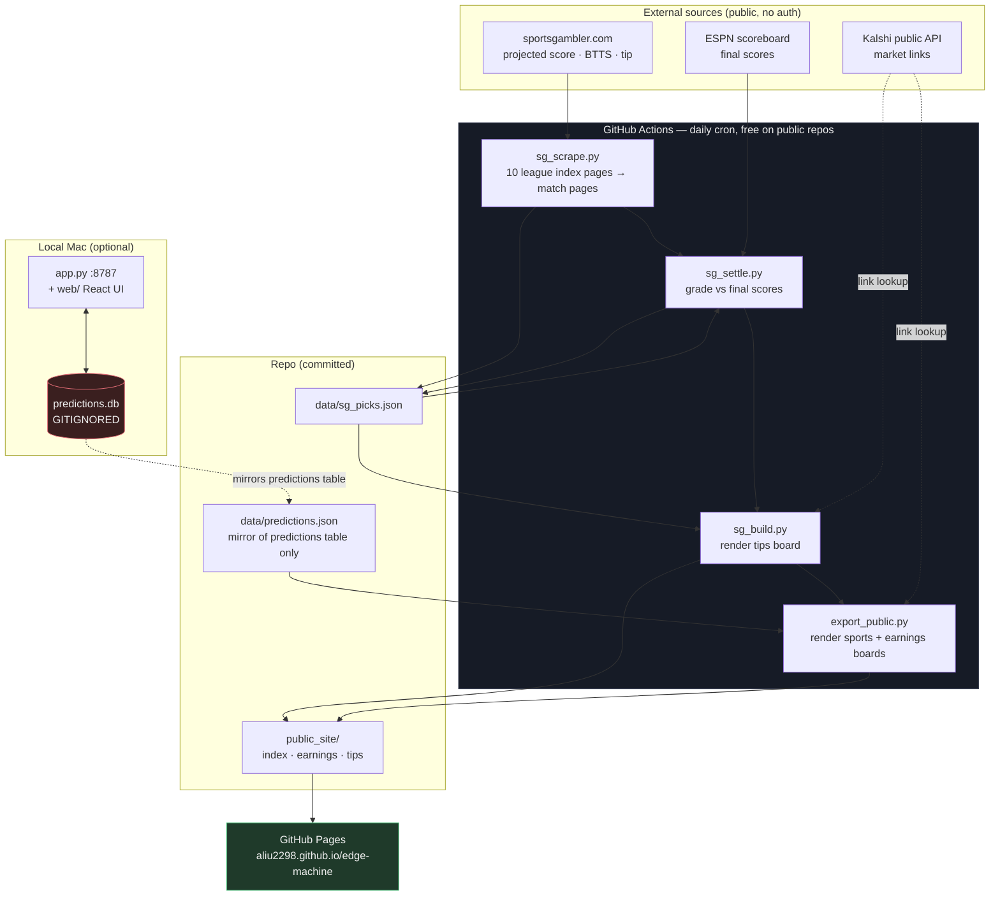

# Edge Machine

Paper-tracked betting research: a local tracker plus a self-updating public board.
Nothing here places bets — every surface is read-only, and results are recorded to test
whether an idea actually holds up.

**Live boards → https://aliu2298.github.io/edge-machine/**

| Board | What it is |
|---|---|
| [Sports](https://aliu2298.github.io/edge-machine/) | Picks made in the local tracker |
| [Earnings](https://aliu2298.github.io/edge-machine/earnings.html) | Kalshi company-quarterly (KPI) positions |
| [Tips](https://aliu2298.github.io/edge-machine/tips.html) | sportsgambler.com's published predictions, scraped and graded |

The three boards are deliberately **separate** — different sources, different edges, no merging.

## Architecture



The pipeline runs entirely on GitHub's servers, so the boards stay current whether or not
the Mac is on. The local tracker is where picks get made; the mirror is how they reach CI.

## Components

| File | Role |
|---|---|
| `app.py` | Local tracker: stdlib HTTP server + SQLite. Picks, slate, base rates, auto-settlement. |
| `web/` | React + Vite + Tailwind UI for the tracker (`npm --prefix web run build`). |
| `sg_scrape.py` | Scrapes sportsgambler for 10 leagues — projected score, BTTS odds, published tip. |
| `sg_settle.py` | Grades scraped tips against ESPN final scores. |
| `sg_build.py` | Renders `public_site/tips.html`. |
| `export_public.py` | Renders the sports + earnings boards; mirrors the predictions table to JSON. |
| `.github/workflows/refresh-tips.yml` | Daily cron: scrape → settle → build → publish to Pages. |

## Run locally

```bash
python3 app.py            # tracker UI + API on :8787
npm --prefix web run dev  # frontend dev server on :5173
```

Rebuild the public boards by hand:

```bash
python3 sg_scrape.py && python3 sg_settle.py && python3 sg_build.py && python3 export_public.py
```

## Data handling

`predictions.db` is **git-ignored** and stays local. It holds `kalshi_orders`, `kalshi_bets`
and `kalshi_config` alongside the picks, so the raw database is never committed. Only the
`predictions` table is mirrored to `data/predictions.json` — the same pick, odds, stake and
result fields already shown on the public boards, with no keys, tokens or balances.

Secrets (`.apifootball_key`, `.kalshi_key`, `.kalshi_pem`, `*.pem`) are git-ignored. A fresh
checkout creates empty tables on first run.

## Notes

Odds from sportsgambler are American and converted to decimal on ingest. Quarter-line Asian
handicaps (`+0.25` / `+0.75`) settle as half win / half loss. Anything that cannot be graded
with confidence is marked `ungraded` with a null P/L rather than being silently scored a loss.

Picks are research, not betting advice.
