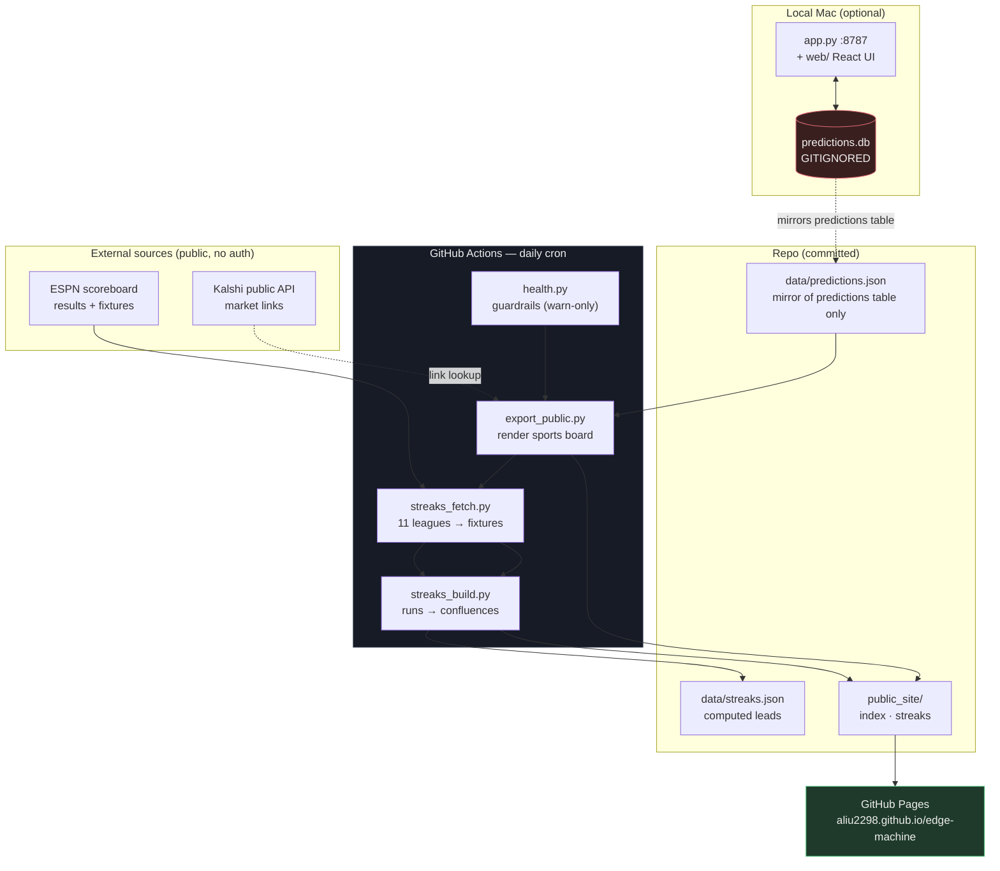

# Edge Machine

Paper-tracked betting research: a local tracker plus a self-updating board.
Nothing here places bets — every surface is read-only, and results are recorded to test
whether an idea actually holds up.

**Board → https://aliu2298.github.io/edge-machine/**

| Board | What it is |
|---|---|
| [Sports](https://aliu2298.github.io/edge-machine/) | Picks made in the local tracker |
| [Streaks](https://aliu2298.github.io/edge-machine/streaks.html) | Teams on an unusual run, matched against a next opponent who is soft in the same place |

## Architecture



The pipeline runs entirely on GitHub's servers, so the board stays current whether or not
the Mac is on. The local tracker is where picks get made; the mirror is how they reach CI.

## Components

| File | Role |
|---|---|
| `app.py` | Local tracker: stdlib HTTP server + SQLite. Picks, slate, base rates, auto-settlement. |
| `web/` | React + Vite + Tailwind UI for the tracker (`npm --prefix web run build`). |
| `export_public.py` | Renders the sports board; mirrors the predictions table to JSON. |
| `streaks_fetch.py` | Pulls recent + upcoming fixtures for 11 leagues from ESPN. |
| `streaks_build.py` | Finds streak confluences and renders `public_site/streaks.html`. |
| `streaks_track.py` | Logs each published lead and grades it once the fixture is played. |
| `streaks_backtest.py` | Walk-forward replay of the same rules over past fixtures. |
| `health.py` | Warn-only guardrails: stuck picks, missing venue links. |
| `.github/workflows/refresh-boards.yml` | Daily cron: check → build → publish to Pages. |

## Run locally

```bash
python3 app.py            # tracker UI + API on :8787
npm --prefix web run dev  # frontend dev server on :5173
```

Rebuild the public boards by hand:

```bash
python3 export_public.py && python3 streaks_build.py
```

## The Streaks board

Tracks 11 leagues: the big five (Premier League, La Liga, Bundesliga, Serie A, Ligue 1),
Eredivisie, Primeira Liga, MLS, Saudi Pro League, and the Champions/Europa Leagues.

A **lead** is not a streak on its own — plenty of good sides score freely. It is a
*confluence*: one team's run meeting the opponent's matching weakness in a fixture that has
not been played yet ("A have scored 2+ in six straight; B have conceded 2+ in five"). Both
legs must run at least 3 games.

Two design choices worth knowing:

* **Form is cross-competition.** A team's last 6 games span every tracked competition, not
  just the one their next fixture belongs to. Form does not reset when a side walks into a
  European tie — and early season it is the only thing that works at all, since UCL/UEL
  sides have played ~2 European games.
* **Every run is shown with its base rate.** This repo has already falsified three signals
  that looked good until measured. The trap each time was reading a pattern without asking
  how often it shows up by chance, so each run is rendered next to the share of tracked
  teams currently on a run that long. A 5-game scoring streak that a fifth of the league is
  also on is not a lead, and the board says so.

Confluences are genuinely rare — whole leagues can have none on a given day. The **All teams
on a run** tab exists for that: it browses every tracked team's current runs directly,
rather than showing an empty league.

### Tracking and grading

Every lead is logged to `data/streak_leads.json` when it is published and graded once its
fixture is played — automatically, in the same daily job. Each pairing carries a
machine-checkable claim (`{"kind": "team_gte", "n": 2, ...}`) so grading never depends on
someone deciding after the fact what a card "meant". A lead that cannot be judged is voided,
never scored as a miss.

**What this measures is information, not profit.** The board carries no odds, so ROI is
unmeasurable — and a hit rate alone says nothing ("over 2.5 landed 60%" is meaningless
without a reference). Each lead is therefore compared against the **league-adjusted base
rate** for that same outcome. The adjustment is not cosmetic: BTTS leads cluster in
high-scoring leagues, and on the backtest a global baseline showed a +17.1pp BTTS lift that
fell to +10.7pp — and lost significance — once each lead was compared against its own
league. **Lift is the number that counts.**

`streaks_backtest.py` replays the same rules over already-played fixtures, computing each
side's form only from games *before* the fixture in question (no lookahead). It exists so
the idea is falsifiable today rather than in a month, and so the grader itself is verified.

**Current state (Aug 2026, n=135 backtested): no bet type's confidence interval clears its
league-adjusted baseline.** Lifts are mostly positive but none are distinguishable from
chance at this sample. No edge is claimed.

Leads are research to look at. Nothing here places or stages a bet.

## Data handling

`predictions.db` is **git-ignored** and stays local. It holds `kalshi_orders`, `kalshi_bets`
and `kalshi_config` alongside the picks, so the raw database is never committed. Only the
`predictions` table is mirrored to `data/predictions.json` — the same pick, odds, stake and
result fields already shown on the board, with no keys, tokens or balances.

Secrets (`.apifootball_key`, `.kalshi_key`, `.kalshi_pem`, `*.pem`) are git-ignored. A fresh
checkout creates empty tables on first run.

## Notes

Quarter-line Asian handicaps (`+0.25` / `+0.75`) settle as half win / half loss. Anything
that cannot be graded with confidence is marked `ungraded` with a null P/L rather than being
silently scored a loss.

## Retired lanes

Removed after measurement, not abandoned on a hunch — each was tracked to a real sample and
falsified:

* **Tips** (sportsgambler.com's published predictions, removed Aug 2026) — all three tracked
  signals measured at n≈160. The tip itself: −0.3% ROI, bootstrap CI [−0.139, +0.131], dead
  flat. BTTS implied side: 62.1% hit vs 63.2% market-implied — well-calibrated, the loss is
  just the vig. Projected exact score: −37.2% ROI, CI [−0.676, −0.017], a *significant*
  loser. No edge to keep.
* **Earnings** (Kalshi company quarterlies + earnings-call mention markets, removed Aug 2026).

Picks are research, not betting advice.
