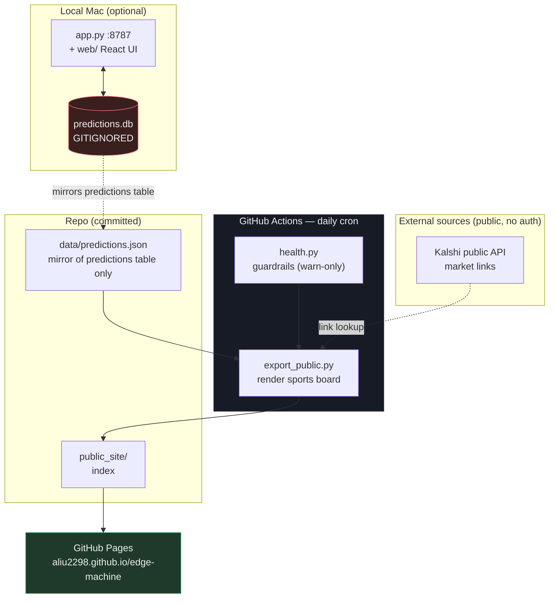

# Edge Machine

Paper-tracked betting research: a local tracker plus a self-updating board.
Nothing here places bets — every surface is read-only, and results are recorded to test
whether an idea actually holds up.

**Board → https://aliu2298.github.io/edge-machine/**

| Board | What it is |
|---|---|
| [Sports](https://aliu2298.github.io/edge-machine/) | Picks made in the local tracker |

## Architecture



The pipeline runs entirely on GitHub's servers, so the board stays current whether or not
the Mac is on. The local tracker is where picks get made; the mirror is how they reach CI.

## Components

| File | Role |
|---|---|
| `app.py` | Local tracker: stdlib HTTP server + SQLite. Picks, slate, base rates, auto-settlement. |
| `web/` | React + Vite + Tailwind UI for the tracker (`npm --prefix web run build`). |
| `export_public.py` | Renders the sports board; mirrors the predictions table to JSON. |
| `health.py` | Warn-only guardrails: stuck picks, missing venue links. |
| `.github/workflows/refresh-tips.yml` | Daily cron: check → build → publish to Pages. |

## Run locally

```bash
python3 app.py            # tracker UI + API on :8787
npm --prefix web run dev  # frontend dev server on :5173
```

Rebuild the public board by hand:

```bash
python3 export_public.py
```

## Data handling

`predictions.db` is **git-ignored** and stays local. It holds `kalshi_orders`, `kalshi_bets`
and `kalshi_config` alongside the picks, so the raw database is never committed. Only the
`predictions` table is mirrored to `data/predictions.json` — the same pick, odds, stake and
result fields already shown on the board, with no keys, tokens or balances.

Secrets (`.apifootball_key`, `.kalshi_key`, `.kalshi_pem`, `*.pem`) are git-ignored. A fresh
checkout creates empty tables on first run.

## Notes

Quarter-line Asian handicaps (`+0.25` / `+0.75`) settle as half win / half loss. Anything
that cannot be graded with confidence is marked `ungraded` with a null P/L rather than being
silently scored a loss.

## Retired lanes

Removed after measurement, not abandoned on a hunch — each was tracked to a real sample and
falsified:

* **Tips** (sportsgambler.com's published predictions, removed Aug 2026) — all three tracked
  signals measured at n≈160. The tip itself: −0.3% ROI, bootstrap CI [−0.139, +0.131], dead
  flat. BTTS implied side: 62.1% hit vs 63.2% market-implied — well-calibrated, the loss is
  just the vig. Projected exact score: −37.2% ROI, CI [−0.676, −0.017], a *significant*
  loser. No edge to keep.
* **Earnings** (Kalshi company quarterlies + earnings-call mention markets, removed Aug 2026).

Picks are research, not betting advice.
